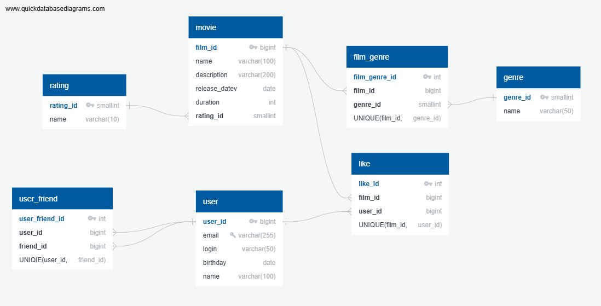

# java-filmorate
Template repository for Filmorate project.
## Database description
This database is designed to store information about user, movie and their interactions in the system.



# Table user
Primary key is field **user_id**. The field **email** contains unique value. The field **login** should not be null. 
Additional information is **name** and **birthday**.
```sql
SELECT *
FROM user
```
```sql
SELECT *
FROM user
WHERE user_id = @user_id
```

# Table user_friend
Users add other users as friends. The table of friendship is many-to-many type connection. 
Primary key is field **user_friend_id**. The field **user_id** contains value of user that send friendship requist. The field **friend_id** is the user that should accept or reject a friend's requiest. 
When user1 send requist of friendship to user2, should be one row in tabele:
```
id1 | user1 | user2
```
When user2 accepted the requist, shoud be two row in table:
```
id1 | user1 | user2
id2 | user2 | user1
```
The values **user_id** and **friend_id** are unique for table **user_friend**.
To get all friendship requests:
```sql
SELECT friend_id
FROM user_friend
WHERE user_id == @user_id TO usersFriends;

SELECT user.name
FROM usersFriends
LEFT JOIN user AS user ON usersFriends.friend_id = user.user_id
```
To get onle accepted friendship
```sql
SELECT user_friend.user_id
FROM user_friend
WHERE friend_id == @user_id TO usersFriends;

SELECT user.name
FROM usersFriends
LEFT JOIN user AS user ON usersFriends.user_id= user.user_id
```
# Table movie and table rating
Primary key is field **movie_id**. The field **rating_id** refer on the table **rating**. This is the one-to-many connection. 
The values **movie_id** and **rating_id** are unique for table **movie**.
```sql
SELECT *
FROM movie
```
```sql
SELECT *
FROM movie
WHERE movie_id = @movie_id
```
# Table film_genre and table genre
A movie have a several count of genres. Genres are generall for all movies. The table **film_genre** is many-to-many type connection. 
Primary key is field **film_genre_id**. The field **film_id** and **genre_id** are unique for table **film_genre**.

When movie1 has two genre, shoud be two row in table:
```
id1 | movie1 | genre1
id2 | movie1 | genre2
```
To get all movie genres:
```sql
SELECT genre_id
FROM film_genre
WHERE film_id == @film_id TO filmsGenres;

SELECT genre.name
FROM filmsGenres
LEFT JOIN genre AS genre ON filmsGenres.genre_id = genre.genre_id
```

# Table likes
Users add a likes to movies. A movie have a several count of likes of users. One user can add like to several count of movies. The table **like** is many-to-many type connection. 
Primary key is field **like_id**. The field **film_id** and **user_id** are unique for table **like**.

The table may look like this:
```
id1 | movie1 | user1
id2 | movie1 | user2
id3 | movie2 | user2
```
To get a count of movie likes:
```sql
SELECT
  COUNT(film_id) AS likes
FROM like
WHERE film_id == @film_id
```


[Комментарии ревьювера]
- Требования бизнес-логики соблюдены, в базе данных нет избыточности 👍
- Для id жанра и рейтинга достаточно типа данных smallint, так как возможных значений для них не так много
- Для friend_id таблицы friends лучше использовать тот же тип, что и для user_id - bigint
- В таблице movies поле rating, ссылающееся на таблицу rating, было бы хорошо назвать rating_id - для поддержания общего стиля именований
